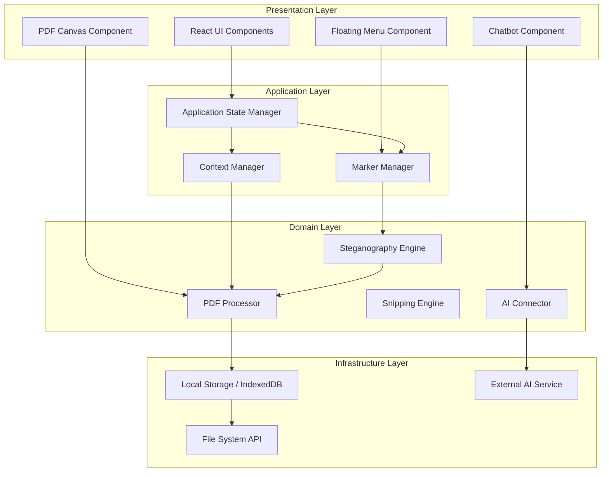

# Design Document: Stego PDF Editor v2

## Overview

Stego PDF Editor v2 is a web-based application that integrates PDF viewing with an AI assistant in a unified interface. The system architecture separates concerns into distinct layers: presentation (UI components), application logic (state management and coordination), domain logic (PDF processing, steganography, AI integration), and infrastructure (storage, external APIs).

The core innovation is the use of steganographic techniques to embed rich contextual data directly within PDF files, making study materials self-contained and portable. Context markers serve as intelligent anchors that the AI can reference, creating a persistent knowledge graph within the document itself.

## Architecture

### High-Level Architecture



### Component Responsibilities

**Presentation Layer:**
- **PDF Canvas Component**: Renders PDF pages, handles user interactions (selection, marker placement), displays context markers
- **Chatbot Component**: Displays conversation history, handles user input, shows AI responses
- **Floating Menu Component**: Provides interface for adding text notes, images, and audio recordings

**Application Layer:**
- **Application State Manager**: Coordinates global application state, manages component communication
- **Context Manager**: Maintains persistent context (opened documents, selections, markers), provides context to AI
- **Marker Manager**: Creates, updates, deletes context markers, manages marker-to-coordinate mappings

**Domain Layer:**
- **PDF Processor**: Renders PDFs, extracts text and images, handles page navigation and zoom
- **Steganography Engine**: Embeds and extracts data using binary steganography, GZIP compression, Base64 encoding
- **Snipping Engine**: Captures selected regions, extracts content, creates context tags
- **AI Connector**: Formats queries with context, communicates with AI service, parses responses

**Infrastructure Layer:**
- **Storage**: Persists application data, marker information, and modified PDFs
- **File System API**: Handles file uploads and downloads
- **AI Service**: External API providing language model capabilities

## Components and Interfaces

### PDF Processor

**Responsibilities:**
- Load and render PDF files
- Extract text and images from PDF pages
- Navigate between pages and handle zoom operations
- Coordinate with Steganography Engine for data embedding/extraction

**Interface:**
```typescript
interface PDFProcessor {
  loadPDF(file: File): Promise<PDFDocument>
  renderPage(pageNumber: number, canvas: HTMLCanvasElement, scale: number): Promise<void>
  extractText(pageNumber: number, region: Rectangle): Promise<string>
  extractImage(pageNumber: number, region: Rectangle): Promise<ImageData>
  getPageCount(): number
  getPageDimensions(pageNumber: number): Dimensions
}

interface PDFDocument {
  id: string
  filename: string
  pageCount: number
  metadata: PDFMetadata
}

interface Rectangle {
  x: number
  y: number
  width: number
  height: number
  pageNumber: number
}

interface Dimensions {
  width: number
  height: number
}
```

### Steganography Engine

**Responsibilities:**
- Embed context markers and associated data into PDF files
- Extract embedded data from PDF files
- Compress text using GZIP
- Encode images using Base64
- Store audio in PDF metadata

**Interface:**
```typescript
interface SteganographyEngine {
  embedMarkers(pdf: PDFDocument, markers: ContextMarker[]): Promise<PDFDocument>
  extractMarkers(pdf: PDFDocument): Promise<ContextMarker[]>
  compressText(text: string): Promise<Uint8Array>
  decompressText(data: Uint8Array): Promise<string>
  encodeImage(image: ImageData): string
  decodeImage(encoded: string): ImageData
  embedAudio(pdf: PDFDocument, audio: AudioData, markerId: string): Promise<PDFDocument>
  extractAudio(pdf: PDFDocument, markerId: string): Promise<AudioData>
}

interface ContextMarker {
  id: string
  position: Rectangle
  type: 'text' | 'image' | 'audio' | 'snippet'
  content: string | ImageData | AudioData
  timestamp: number
  contextTag?: ContextTag
}

interface ContextTag {
  sourceDocument: string
  coordinates: Rectangle
  extractedText?: string
}

interface AudioData {
  blob: Blob
  duration: number
  format: string
}
```

### Context Manager

**Responsibilities:**
- Maintain list of all context items (documents, markers, selections)
- Provide context to AI Connector for queries
- Add and remove items from persistent context
- Track context relationships and dependencies

**Interface:**
```typescript
interface ContextManager {
  addDocument(doc: PDFDocument): void
  removeDocument(docId: string): void
  addMarker(marker: ContextMarker): void
  removeMarker(markerId: string): void
  addSelection(selection: Selection): void
  getContext(): ContextSnapshot
  clearContext(): void
}

interface Selection {
  id: string
  content: string | ImageData
  source: Rectangle
  timestamp: number
}

interface ContextSnapshot {
  documents: PDFDocument[]
  markers: ContextMarker[]
  selections: Selection[]
  conversationHistory: Message[]
}
```

### Snipping Engine

**Responsibilities:**
- Handle drag-select interactions on PDF canvas
- Extract content from selected regions
- Create context tags with coordinate information
- Inject snipped content into chatbot

**Interface:**
```typescript
interface SnippingEngine {
  startSnip(startPoint: Point): void
  updateSnip(currentPoint: Point): void
  completeSnip(): Promise<Snippet>
  cancelSnip(): void
}

interface Point {
  x: number
  y: number
  pageNumber: number
}

interface Snippet {
  id: string
  region: Rectangle
  textContent?: string
  imageContent?: ImageData
  contextTag: ContextTag
}
```

### AI Connector

**Responsibilities:**
- Format user queries with persistent context
- Send requests to external AI service
- Parse and format AI responses
- Handle streaming responses
- Manage conversation history

**Interface:**
```typescript
interface AIConnector {
  sendQuery(query: string, context: ContextSnapshot): Promise<AIResponse>
  streamQuery(query: string, context: ContextSnapshot): AsyncIterator<string>
  formatContext(context: ContextSnapshot): string
  addMessage(message: Message): void
  getConversationHistory(): Message[]
}

interface AIResponse {
  text: string
  references: Reference[]
  timestamp: number
}

interface Reference {
  markerId?: string
  documentId?: string
  coordinates?: Rectangle
}

interface Message {
  id: string
  role: 'user' | 'assistant'
  content: string
  timestamp: number
  references: Reference[]
}
```

### Marker Manager

**Responsibilities:**
- Create context markers at specified coordinates
- Update marker content and positions
- Delete markers
- Manage marker visibility and highlighting
- Coordinate with Steganography Engine for persistence

**Interface:**
```typescript
interface MarkerManager {
  createMarker(position: Rectangle, type: MarkerType, content: MarkerContent): Promise<ContextMarker>
  updateMarker(markerId: string, updates: Partial<ContextMarker>): Promise<void>
  deleteMarker(markerId: string): Promise<void>
  getMarker(markerId: string): ContextMarker | null
  getMarkersForPage(pageNumber: number): ContextMarker[]
  highlightMarker(markerId: string): void
  unhighlightMarker(markerId: string): void
}

type MarkerType = 'text' | 'image' | 'audio' | 'snippet'
type MarkerContent = string | ImageData | AudioData
```

## Data Models

### Core Data Structures

**PDFDocument:**
```typescript
interface PDFDocument {
  id: string                    // Unique identifier
  filename: string              // Original filename
  pageCount: number             // Total pages
  metadata: PDFMetadata         // PDF metadata
  embeddedData?: EmbeddedData   // Steganographic data
}

interface PDFMetadata {
  title?: string
  author?: string
  creationDate?: Date
  modificationDate?: Date
  customFields: Record<string, string>
}

interface EmbeddedData {
  markers: ContextMarker[]
  version: string
  checksum: string
}
```

**ContextMarker:**
```typescript
interface ContextMarker {
  id: string                    // Unique identifier
  position: Rectangle           // Location in PDF
  type: MarkerType              // Content type
  content: MarkerContent        // Actual content
  timestamp: number             // Creation time
  contextTag?: ContextTag       // Optional source reference
  metadata: MarkerMetadata      // Additional info
}

interface MarkerMetadata {
  color?: string
  label?: string
  tags: string[]
  isHighlighted: boolean
}
```

**Application State:**
```typescript
interface ApplicationState {
  currentDocument: PDFDocument | null
  currentPage: number
  zoomLevel: number
  markers: Map<string, ContextMarker>
  persistentContext: ContextSnapshot
  uiState: UIState
}

interface UIState {
  isSnipping: boolean
  isRecording: boolean
  floatingMenuVisible: boolean
  floatingMenuPosition: Point
  selectedMarkerId: string | null
  splitViewRatio: number
}
```

### State Transitions

**Document Loading Flow:**
1. User selects PDF file
2. PDF Processor loads and parses file
3. Steganography Engine extracts embedded markers
4. Context Manager adds document to persistent context
5. UI renders first page with markers

**Marker Creation Flow:**
1. User invokes floating menu
2. User provides content (text/image/audio)
3. Marker Manager creates marker with coordinates
4. Context Manager adds marker to persistent context
5. Steganography Engine embeds marker in PDF
6. Storage persists modified PDF

**Snipping Flow:**
1. User drags to select region
2. Snipping Engine captures selection bounds
3. PDF Processor extracts content from region
4. Snipping Engine creates context tag
5. Context Manager adds snippet to persistent context
6. Chatbot displays snippet with context tag

## Correctness Properties

*A property is a characteristic or behavior that should hold true across all valid executions of a system—essentially, a formal statement about what the system should do. Properties serve as the bridge between human-readable specifications and machine-verifiable correctness guarantees.*


### Property 1: Context Addition for All Content Types
*For any* content item (PDF document, image, audio file, or user selection), when it is added to the system, it should appear in the Persistent_Context and be accessible to the Chatbot.
**Validates: Requirements 2.1, 2.2, 2.3**

### Property 2: Context Availability for Queries
*For any* user query and any set of context items in Persistent_Context, the Chatbot should receive all context items when processing the query.
**Validates: Requirements 2.4**

### Property 3: Context Removal
*For any* document in Persistent_Context, when it is closed, it should no longer appear in Persistent_Context.
**Validates: Requirements 2.5**

### Property 4: Marker Creation at Coordinates
*For any* valid PDF coordinates and marker content, creating a marker should result in a Context_Marker instance positioned at those exact coordinates.
**Validates: Requirements 3.1, 3.2**

### Property 5: Marker Click Adds to Context
*For any* Context_Marker, when clicked, its associated content should be added to Persistent_Context.
**Validates: Requirements 3.3**

### Property 6: Marker Highlighting on Reference
*For any* Context_Marker referenced in a chat message, the marker should be visually highlighted in the PDF_Canvas.
**Validates: Requirements 3.5**

### Property 7: Snipping Captures Region
*For any* drag selection in the PDF_Canvas, the Snipping_Tool should capture the selected region with exact coordinate boundaries.
**Validates: Requirements 4.1**

### Property 8: Snippet Content Extraction
*For any* snipped region, the system should extract both text and visual data from that region.
**Validates: Requirements 4.2, 4.5**

### Property 9: Snippet Context Tag Creation
*For any* completed snippet, the system should create a Context_Tag containing the exact PDF coordinates of the snipped region.
**Validates: Requirements 4.3**

### Property 10: Snippet Injection to Chatbot
*For any* completed snippet, it should appear in the Chatbot with its Context_Tag attached.
**Validates: Requirements 4.4**

### Property 11: Floating Menu Marker Creation
*For any* content created through the Floating_Menu (text note, image upload, or voice recording), the system should create a Context_Marker containing that content and index it for AI understanding.
**Validates: Requirements 5.3, 5.4, 5.5, 5.6**

### Property 12: Text Compression Threshold
*For any* text content, if its size exceeds the compression threshold, it should be GZIP-compressed before embedding; otherwise, it should be embedded uncompressed.
**Validates: Requirements 6.2**

### Property 13: PDF Visual Integrity Invariant
*For any* PDF and any set of Context_Markers, embedding the markers should produce a PDF that is visually identical to the original when rendered.
**Validates: Requirements 6.5**

### Property 14: Steganographic Round-Trip
*For any* Context_Marker with text, image, or audio content, embedding it into a PDF and then extracting it should produce an equivalent marker with the same content.
**Validates: Requirements 6.1, 6.3, 6.4, 7.2, 7.3, 7.4, 7.5**

### Property 15: Extraction Adds to Context
*For any* PDF with embedded markers, when Deep_Context_Scan completes extraction, all extracted markers should be present in Persistent_Context.
**Validates: Requirements 7.6**

### Property 16: Page Navigation Correctness
*For any* PDF and any valid page number, navigating to that page should display the correct page content and update the page indicator.
**Validates: Requirements 9.2, 9.5**

### Property 17: Zoom Level Application
*For any* PDF and any valid zoom level, applying the zoom should scale the rendered content by the specified factor.
**Validates: Requirements 9.3**

### Property 18: Query Context Inclusion
*For any* user query submitted to the Chatbot, the query should be processed with access to all items currently in Persistent_Context.
**Validates: Requirements 10.2**

### Property 19: Conversation Context Retention
*For any* multi-turn conversation, each subsequent query should have access to all previous messages in the conversation history.
**Validates: Requirements 10.4**

### Property 20: Content Reference Visual Indicators
*For any* Chatbot response that references specific PDF content, visual indicators should appear at the referenced locations in the PDF_Canvas.
**Validates: Requirements 10.5**

### Property 21: Marker Persistence Round-Trip
*For any* set of Context_Markers created in a PDF, closing and reopening the PDF should restore all markers with their original positions and content intact.
**Validates: Requirements 11.1, 11.2, 11.3, 11.4**

### Property 22: Concurrent Modification Safety
*For any* sequence of concurrent marker creation or modification operations, all operations should complete successfully without data loss or corruption.
**Validates: Requirements 11.5**

### Property 23: Audio Recording Capture
*For any* audio recording session, starting and stopping the recording should produce saved audio data with the correct duration.
**Validates: Requirements 12.2, 12.3**

### Property 24: Audio Playback
*For any* recorded audio data, the system should be able to play it back successfully.
**Validates: Requirements 12.4**

### Property 25: Recording Duration Tracking
*For any* active audio recording, the displayed duration should accurately reflect the elapsed recording time.
**Validates: Requirements 12.5**

## Error Handling

### Error Categories

**File Processing Errors:**
- Invalid PDF format
- Corrupted PDF files
- Unsupported PDF versions
- File size exceeds limits

**Steganography Errors:**
- Extraction failure (no embedded data found)
- Corrupted embedded data
- Checksum mismatch
- Decompression failure

**AI Service Errors:**
- API unavailable
- Rate limiting
- Invalid response format
- Timeout

**Storage Errors:**
- Quota exceeded
- Permission denied
- Concurrent modification conflicts

**User Input Errors:**
- Invalid coordinates (out of bounds)
- Empty content
- Unsupported file formats
- Microphone permission denied

### Error Handling Strategies

**Graceful Degradation:**
- If steganographic extraction fails, continue with empty marker set
- If AI service is unavailable, display cached responses or error message
- If storage quota is exceeded, prompt user to clear old data

**User Feedback:**
- Display clear error messages with actionable guidance
- Show progress indicators for long-running operations
- Provide retry options for transient failures

**Data Integrity:**
- Validate all user inputs before processing
- Use checksums to verify embedded data integrity
- Implement atomic operations for marker persistence
- Maintain backup of original PDF before modifications

**Recovery Mechanisms:**
- Auto-save markers periodically
- Maintain undo/redo history
- Allow manual export of markers as JSON
- Support importing markers from backup

## Testing Strategy

### Dual Testing Approach

The testing strategy employs both unit tests and property-based tests to ensure comprehensive coverage:

**Unit Tests** focus on:
- Specific examples demonstrating correct behavior
- Edge cases (empty inputs, boundary values, special characters)
- Error conditions and exception handling
- Integration points between components
- UI component rendering and interactions

**Property-Based Tests** focus on:
- Universal properties that hold for all inputs
- Round-trip properties (encode/decode, embed/extract)
- Invariants (visual integrity, data preservation)
- Comprehensive input coverage through randomization

Together, these approaches provide complementary coverage: unit tests catch concrete bugs in specific scenarios, while property tests verify general correctness across a wide input space.

### Property-Based Testing Configuration

**Library Selection:**
- For TypeScript/JavaScript: Use **fast-check** library
- Minimum 100 iterations per property test (due to randomization)
- Each test must reference its design document property

**Test Tagging Format:**
```typescript
// Feature: stego-pdf-editor-v2, Property 14: Steganographic Round-Trip
test('embedding and extracting markers preserves content', () => {
  fc.assert(
    fc.property(
      arbitraryContextMarker(),
      arbitraryPDF(),
      async (marker, pdf) => {
        const embedded = await stegoEngine.embedMarkers(pdf, [marker]);
        const extracted = await stegoEngine.extractMarkers(embedded);
        expect(extracted[0]).toEqual(marker);
      }
    ),
    { numRuns: 100 }
  );
});
```

### Test Coverage Requirements

**Core Functionality:**
- PDF loading and rendering
- Marker creation, update, deletion
- Snipping and content extraction
- Steganographic embedding and extraction
- Context management
- AI query formatting and response handling

**Integration Tests:**
- End-to-end marker creation and persistence flow
- Snipping to chatbot injection flow
- Document loading with extraction flow
- Multi-document context management

**Property Tests (one per correctness property):**
- Property 1: Context addition for all content types
- Property 2: Context availability for queries
- Property 3: Context removal
- Property 4: Marker creation at coordinates
- Property 5: Marker click adds to context
- Property 6: Marker highlighting on reference
- Property 7: Snipping captures region
- Property 8: Snippet content extraction
- Property 9: Snippet context tag creation
- Property 10: Snippet injection to chatbot
- Property 11: Floating menu marker creation
- Property 12: Text compression threshold
- Property 13: PDF visual integrity invariant
- Property 14: Steganographic round-trip
- Property 15: Extraction adds to context
- Property 16: Page navigation correctness
- Property 17: Zoom level application
- Property 18: Query context inclusion
- Property 19: Conversation context retention
- Property 20: Content reference visual indicators
- Property 21: Marker persistence round-trip
- Property 22: Concurrent modification safety
- Property 23: Audio recording capture
- Property 24: Audio playback
- Property 25: Recording duration tracking

### Testing Tools and Frameworks

**Unit Testing:**
- Jest or Vitest for test runner
- React Testing Library for component tests
- Mock Service Worker for API mocking

**Property-Based Testing:**
- fast-check for property test generation
- Custom arbitraries for domain objects (PDFs, markers, coordinates)

**Integration Testing:**
- Playwright or Cypress for end-to-end tests
- Test against real PDF files
- Mock AI service responses

**Performance Testing:**
- Benchmark steganographic operations
- Test with large PDFs (100+ pages)
- Measure marker extraction time
- Monitor memory usage during long sessions
